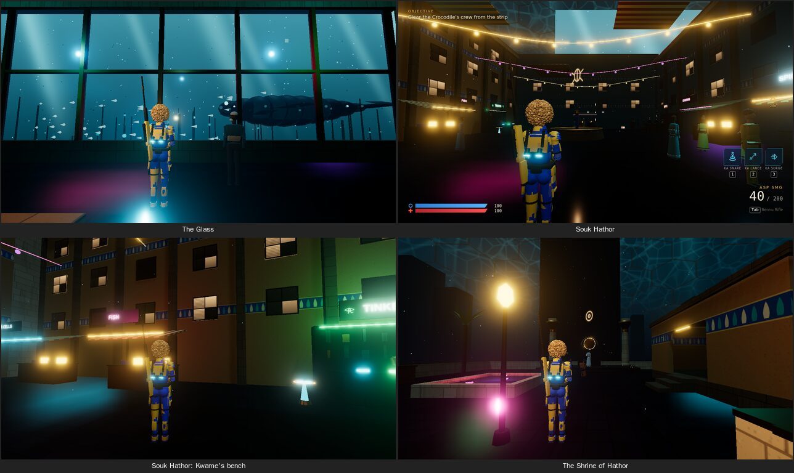
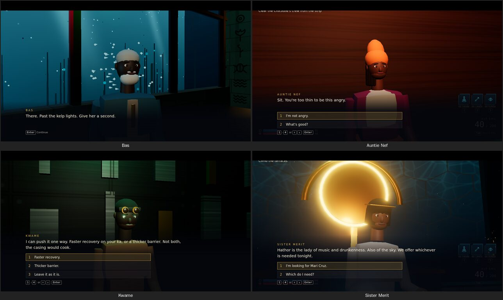
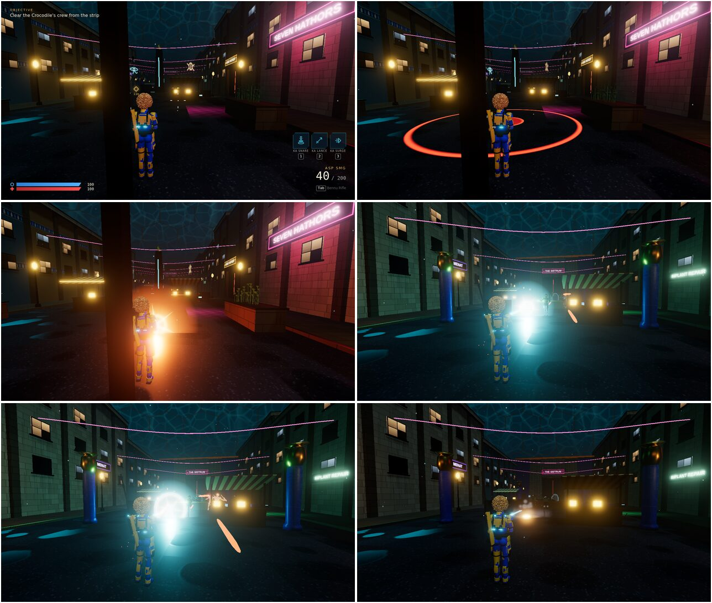

# Neo Atlantis: Hathor's Reach

A single-level third-person shooter for the browser. You play Imani Cruz,
who has come down to an undersea domed city looking for her sister. The
level runs from the train dock, up the neon strip, through a nightclub and
over the terraces to the Crocodile's drained sacred lake, with three
optional places off the route and people to talk to along the way. It
takes 15-25 minutes. The combat is cover, two guns and three ka powers that
combo off each other, plus ka cells to blow up and grenades to dodge.
Built with three.js, Rapier and TypeScript. Every model and texture is
built in code; music and sound effects are CC0/CC-BY recordings (see
[CREDITS.md](CREDITS.md)).

**Play:** https://marzuwqlion.github.io/BlastEffect/ (after the one-time
Pages setup below).

## Controls

Keyboard/mouse and gamepad both work, and you can switch between them at
any time. On-screen prompts follow whichever device you used last. All
bindings live in one table: `src/input/bindings.ts`.

| Action | Keyboard / mouse | Gamepad |
| --- | --- | --- |
| Move / look | WASD / mouse | Left stick / right stick |
| Fire / aim | Left / right mouse | RT / LT |
| Reload | R | X |
| Jump-jet (hold in air to hover) | Space | A |
| Sprint | Shift | L3 |
| Dash | Q | B |
| Ka Snare (primer) | 1 | LB |
| Ka Lance (detonator) | 2 | RB |
| Ka Surge (detonator, charge) | 3 | LB + RB |
| Melee | V | R3 |
| Interact / talk | E | X |
| Swap weapon | Tab | Y |
| Swap shoulder | X | D-pad left |
| Pause | Esc | Menu (Start) |
| Debug overlay | ` (backtick) | |

Nothing is bound to Ctrl, so Ctrl+W can't close the tab mid-fight. Cover is
automatic: with a weapon out, move into a low wall or pillar to take cover,
and aim to pop out. To combo, Snare a target whose shields and armor are
gone, then hit it with a Lance or a Surge.

The settings menu (from the title screen or pause) has look sensitivity,
invert Y, master/music/SFX volume, quality (low/medium/high), text size
and aim assist (gamepad only, on by default). Losing pointer lock pauses
the game.

## Off the main path

Three optional areas, each with its own music, ambience and someone to
talk to. A toast names each place the first time you walk in.

| Place | Where | Who | What you get |
| --- | --- | --- | --- |
| **The Glass** | Through the opening in the dock's east wall | Bas Okafor, retired dome diver | A window onto the open sea. Ask him and Grandmother, an old leviathan, swims past. His advice makes the crew slower to aim at you while you hover above them. |
| **Souk Hathor** | Shutters on the strip's east side open after the first fight | Auntie Nef (noodle counter), Kwame (implant tinker) | Nef feeds you (full health and barrier) and tips you off about the terrace shift change (one fewer enemy up top). Kwame tunes your ka-amp: faster power recovery or a thicker barrier. |
| **The Shrine of Hathor** | Bridge off the west side of the middle terrace | Sister Merit | A rooftop temple garden and Mari's rented room. Merit gives you a letter Mari left. |




Mari's five holo-recordings are hidden in these places and along the
route (the Glass, the souk, behind the club's bar, Mari's room, by the
Basin gate). Everything you do here carries into the ending text, and
the dialogue choices that matter survive a death.

People live in the Reach: travellers at the dock, shoppers on the strip
and in the market, dancers in the club, worshippers at the shrine. When
a fight starts they run for an exit or duck behind the stalls, and get
up again when it's over.

**Ka cells** (dark canisters with a glowing cyan band) are stacked around
the crew's positions. Shoot one, hit it with a Lance or catch it in a ka
burst: it hisses for a moment, then blows, flinging anyone nearby and
setting off other cells. Stray enemy fire can set one off too, so don't
hide behind them. **Grenades:** grunts lob one if you sit behind the same
cover too long. It beeps and marks a red ring where it will go off.



## Running locally

Requires Node 22+.

```sh
npm install
npm run dev        # http://localhost:5173/BlastEffect/
npm run build      # typecheck + production build into dist/
npm run preview    # serve dist/ at http://localhost:4173/BlastEffect/
npm test           # unit tests (Vitest)
```

## Deploying to GitHub Pages

`.github/workflows/deploy.yml` runs the tests, builds and deploys to GitHub
Pages on every push to `main` (or from the Actions tab via "Run workflow").
The site's base path is taken from the repository name, so forks deploy
correctly with no changes.

**One-time setup:** in the repository on GitHub, go to **Settings → Pages →
Build and deployment → Source** and choose **GitHub Actions**. Until you
do, the workflow's build job still passes but the deploy job fails with
"Get Pages site failed". To build for some other host or path, set
`BASE_PATH` (for example `BASE_PATH=/ npm run build`).

## Debug tools

- **Backtick (`)** toggles the debug overlay: fps, frame time, draw calls,
  triangles, enemies alive/active, attack tokens in use, live bolts,
  quality preset, section, position and god mode.
- **URL parameters** (can be combined, e.g. `?section=5&god=1`):

  | Parameter | Effect |
  | --- | --- |
  | `section=1..5` | Start at a section's checkpoint: 1 dock, 2 strip, 3 club, 4 terraces, 5 boss arena |
  | `god=1` | Player takes no damage |
  | `quality=low\|medium\|high` | Override the quality preset |
  | `debug=1` | Show the debug overlay from the start |
  | `autostart=1` | Skip the title screen |
  | `flags=a,b` | Preset dialogue flags, e.g. `flags=intel_weakpoint` marks the boss weak point |
  | `manual=1` | Don't run the frame loop; the game steps only when told (automation) |

- **Scripted checks** (headless Chromium via Playwright; build first):
  `npm run build && npm run shots -- <scenario>`. Screenshots go to
  `docs/screenshots/`, and any console errors fail the run. Scenarios:
  `boot` (real-time start from the title screen, as a player would:
  fails if the camera doesn't follow Imani), `sections` (every section,
  draw calls and triangles), `playthrough`
  (a bot plays title to end screen; `PAD=1` drives it through a simulated
  gamepad), `boss`, `combat` (time to kill and combos per enemy type),
  `movement`, `camera`, `cover`, `gamepad`, `dialogue`, `title`,
  `closeup`, `anims`, `fight`, `tour`.
- **Console:** `window.__game` exposes the running game (for example
  `__game.player.teleport({x:0,y:9,z:-290})` or `__game.simulate(2)`).

## If the screen goes black

The quality setting is saved in the browser. If a preset is too much for
your GPU, the game steps post-processing down by itself; if the GPU drops
the WebGL context entirely, you get a "Graphics reset" notice and the
saved quality is lowered for the next load. To force a preset for one
load, add `?quality=low` (or `medium`) to the URL, then change it in
Settings. The browser console (F12) shows any shader or WebGL errors.

## Tuning

Every gameplay number lives in **`src/config.ts`**: movement (speeds,
jump, hover, dash), camera (FOVs, distances, shake, recoil), cover,
shields/health and regen, weapons (damage, fire rate, magazines, reload,
layer multipliers, headshot and weak point), powers (cooldowns, damage,
combo radius and stagger), each enemy type, AI (attack tokens, minimum
telegraph time, cover and flanking), the boss (layers, attacks, phase
tempo, reinforcements), hit-stop and feedback, quality presets and
performance budgets. Unit tests in `tests/` check the feel targets
(time to kill per enemy, boss fight length), so `npm test` tells you
when a change moves one out of range.

All names and text are in **`src/strings.ts`**: characters, places, UI
labels, prompts, objectives, enemy barks, the dialogue trees and the end
screen. The dialogue trees are validated by `tests/dialogue.test.ts`
(no dead ends, no missing or unreachable nodes, no loops without an exit,
and at least one choice sets a flag that pays off later).

## Audio

Every sound effect, music cue and ambience bed goes through
**`src/audio/manifest.ts`**. The files in `public/audio/` were cut from
CC0 and CC-BY packs by `scripts/audio/process.py` (trim, silence removal,
layering, loudness matching, seamless loop points, MP3); sources and
licences are in [CREDITS.md](CREDITS.md). To rebuild them, download the
packs listed there into one folder and run
`python3 scripts/audio/process.py <folder>` (needs ffmpeg).

To swap a sound, put a file in `public/audio/` and point the entry at it
(`src` takes one path or a list of variants picked at random):

```ts
smgShot: { src: ['audio/sfx/smg1.mp3', 'audio/sfx/smg2.mp3'], bus: 'sfx', volume: 0.7, pitchVar: 0.05, voices: 6 },
```

An entry without `src` (or whose file fails to load) falls back to a
placeholder synthesized at startup (`src/audio/synth.ts`, and
`src/audio/music.ts` for the score). Music and ambience stream and
crossfade; each section and optional area picks its cue in its
definition under `src/level/sections/`.

## Performance

On the medium preset each section draws 140-320 draw calls and about
270-430k triangles from its checkpoint view (budget: under 500 and 1.5M). Most of
that comes from merging level geometry per material in 60 m chunks,
instancing props, drawing only the current section and its neighbours,
a fixed pool of point lights that move to the nearest light anchors (so
shaders never recompile), pooled enemies, bolts and particles, and one
skinned draw call per character (the crowds are culled with their
section and by distance; ka cells are three instanced meshes in total).
The low preset turns off shadows, bloom and caustics, halves hair density
and particles, uses fewer point lights and lowers the pixel ratio.

## Project layout

```
src/
  config.ts, strings.ts   tuning and all text
  core/                   physics (Rapier), renderer, time, settings, events
  input/                  input map and device handling (keyboard/mouse, gamepad)
  player/                 controller, camera rig, weapons, powers, aim assist
  character/              Imani (built from docs/protagonist.md), the NPCs and the crowds
  enemies/                crew AI, models, bolts, the Crocodile boss
  combat/                 damage layers, combos, feedback, ka cells and grenades
  level/                  level builder, materials, kit, nav grid, cover, sections (zones.ts: the optional areas)
  render/                 shader chunks, dome and sea life, the leviathan, light pool
  fx/, audio/, ui/        effects, synthesized audio, HUD/menus/dialogue
  dialogue/               dialogue types and validator
  game/                   game state machine and level director
tests/                    Vitest unit tests
scripts/                  Playwright screenshot and playthrough scripts
docs/                     protagonist reference, screenshots
PLAN.md                   milestones and progress log
```
